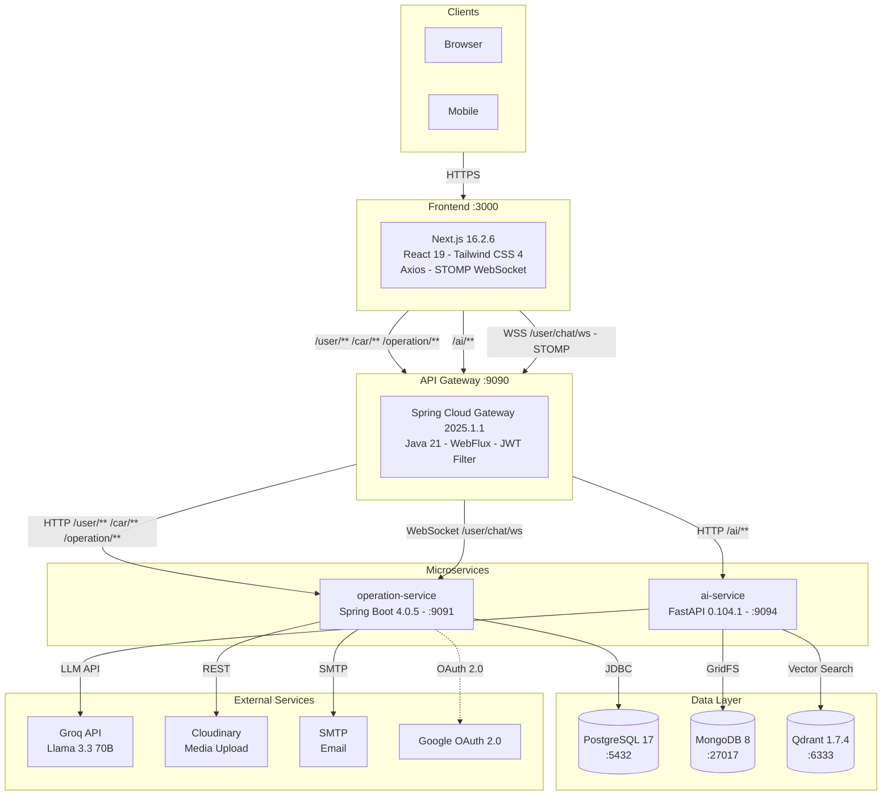
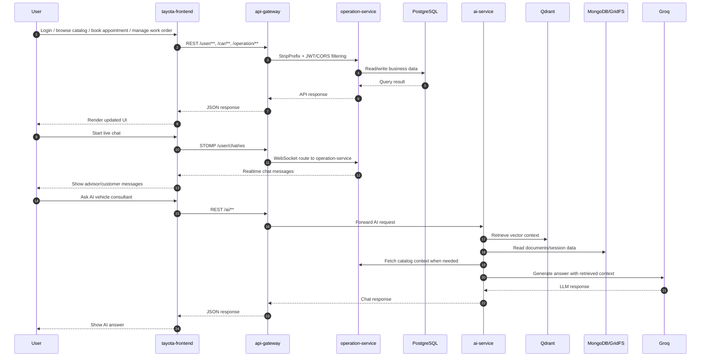
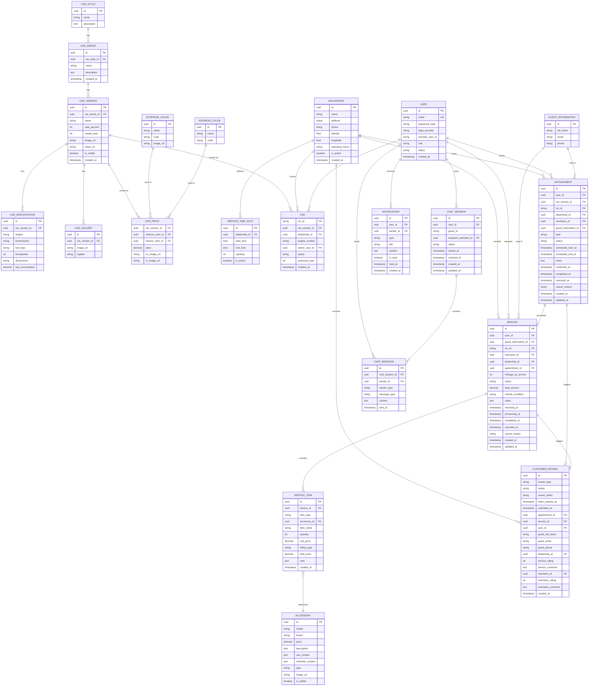
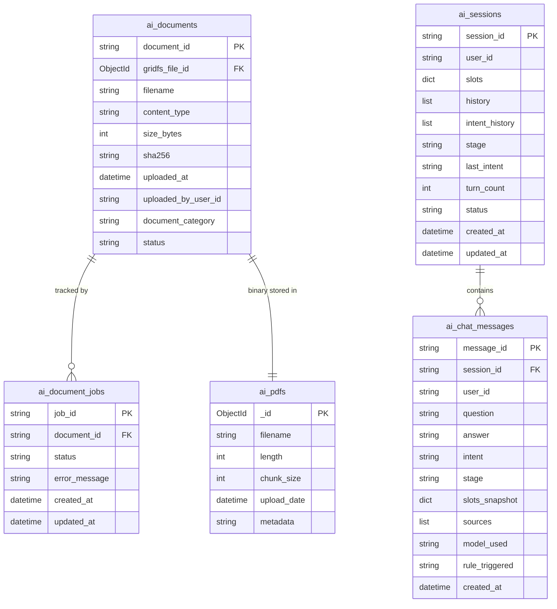

# Tayota — Toyota Service Management & Consulting Platform

> Language: **English** | [Tiếng Việt](README.vi.md)

<div align="center">


**Tayota** is a microservices-based Toyota service management and consulting platform, featuring a Next.js frontend, Spring Boot backend, and a FastAPI AI service powered by RAG for PDF-based vehicle consultation.

[Features](#features) · [Architecture](#architecture) · [Installation](#installation) · [Demo Accounts](#demo-accounts) · [API Docs](#api-documentation) · [Testing](#testing) · [Deployment](#deployment)

</div>

---

## Table of Contents

- [Features](#features)
- [Architecture](#architecture)
  - [System Overview](#system-overview)
  - [Main Processing Flow](#main-processing-flow)
  - [Database Schema](#database-schema)
  - [Frontend Rendering Strategy](#frontend-rendering-strategy)
  - [Project Structure](#project-structure)
- [Tech Stack](#tech-stack)
- [Prerequisites](#prerequisites)
- [Installation](#installation)
- [Demo Accounts](#demo-accounts)
- [API Documentation](#api-documentation)
- [Testing](#testing)
- [Deployment](#deployment)
- [License](#license)

---

## Features

### Customer (USER)
- Email/password registration & login (JWT + Refresh Token via HTTP-only cookie)
- Google OAuth 2.0 login
- Email verification, forgot/change password, session management
- Browse Toyota vehicle catalog by series, version, specs, and pricing
- Book test drives and maintenance appointments (with daily limits and minimum lead time)
- Live chat with advisors via WebSocket (STOMP)
- AI vehicle consultant powered by RAG (from internal PDF documents)
- Email notifications on appointment updates
- Submit reviews after service completion (token-based, auto-expiring)
- View account info and service history

### Service Advisor
- Accept and manage test drive / maintenance appointments
- Create work orders and assign mechanics
- Update work order status and send customer notifications
- Real-time live chat support for customers
- Personal dashboard (appointments, work orders, statistics)

### Assistant
- Manage vehicle catalog and model information
- Manage specs, pricing, and vehicle images
- Support advisors in handling customer requests

### Mechanic
- Receive and update assigned work order status
- Report repair progress via dashboard
- Notify on job completion

### Manager
- System overview dashboard (appointments, work orders, revenue)
- Staff management and role assignment
- Full vehicle catalog management
- Detailed time-based statistics and reports

### Admin
- Account management (view, ban/unban, change roles)
- System overview dashboard
- AI document management (upload PDFs, rebuild vector index)
- View AI usage history (sessions, token usage)

### System
- JWT + Refresh Token with per-session revocation
- RBAC with 6 roles: `ADMIN`, `MANAGER`, `SERVICE_ADVISOR`, `ASSISTANT`, `MECHANIC`, `USER`
- Smart API Gateway routing: `/user/**`, `/car/**`, `/operation/**` -> operation-service; `/ai/**` -> ai-service
- Docker Compose for full infrastructure (PostgreSQL, MongoDB, Qdrant, Gateway, Services)
- Caffeine in-memory caching for operation-service
- Realtime via STOMP WebSocket (live chat) and Server-Sent Events
- Gateway-to-service communication over HTTP and WebSocket according to `application.yml`
- Email notifications via Spring Mail + SMTP
- Media upload to Cloudinary
- RAG chatbot with Qdrant vector search + Groq LLM (Llama 3.3)
- Unit + integration tests for operation-service and ai-service

---

## Architecture

### System Overview

The project is split into four independent processes — `tayota-frontend` (Next.js), `api-gateway` (Spring Cloud Gateway WebFlux), `operation-service` (Spring Boot 4), and `ai-service` (FastAPI + RAG). All frontend API calls are routed through the Gateway on port `:9090`.



**Communication summary:**

| From | To | Protocol |
|------|----|----------|
| Browser / Mobile | Frontend | HTTPS |
| Frontend | API Gateway | HTTPS / WSS (STOMP) |
| API Gateway | operation-service | HTTP / WebSocket |
| API Gateway | ai-service | HTTP |
| operation-service | PostgreSQL | JDBC |
| operation-service | Cloudinary | REST |
| operation-service | SMTP | SMTP |
| operation-service | Google | OAuth 2.0 |
| ai-service | MongoDB | GridFS |
| ai-service | Qdrant | REST |
| ai-service | Groq | REST |

---

### Main Processing Flow



---

### Database Schema

#### PostgreSQL — operation-service

Full relational schema covering authentication, vehicle catalog, appointments, work orders, reviews, live chat, and notifications.



---

#### MongoDB — ai-service

Collections for AI document management, RAG chat sessions, and processing jobs.



> **Vector storage (Qdrant):** PDF chunks are embedded with `sentence-transformers` and stored in Qdrant. Each vector point links back to its source `document_id` in MongoDB to enable citation tracing during RAG retrieval.

---

### Frontend Rendering Strategy

| Route | Strategy | Reason |
|-------|----------|--------|
| `/` (Landing) | SSR + short cache | SEO & first paint |
| `/vehicles` | SSR / dynamic fetch | Vehicle catalog with filtering data |
| `/vehicles/[id]` | SSR | Dynamic vehicle details, specs, gallery, and accessories |
| `/appointments/*` | SSR + client forms | Test-drive and service appointment booking |
| `/support/live-chat` | Client-side | Realtime WebSocket live chat |
| `#ai-chat` widget | Client-side | Floating AI consultant in the app layout |
| `/dashboard/*` | SSR `force-dynamic` + client panels | Role-based personal dashboards |

---

### Project Structure

```
Tayota/
├── tayota-frontend/                  # Next.js 16.2.6 (App Router)
│   ├── src/
│   │   ├── app/
│   │   │   ├── appointments/
│   │   │   ├── auth/
│   │   │   ├── compare/
│   │   │   ├── dashboard/
│   │   │   ├── dealerships/
│   │   │   ├── news/
│   │   │   ├── notifications/
│   │   │   ├── reviews/
│   │   │   ├── support/live-chat/
│   │   │   ├── vehicles/
│   │   │   └── verify-account/
│   │   ├── components/
│   │   │   ├── layout/              # Header, Footer
│   │   │   ├── vehicles/            # Vehicle cards, specs, gallery
│   │   │   ├── appointments/
│   │   │   ├── chat/
│   │   │   ├── dashboard/
│   │   │   ├── notifications/
│   │   │   └── reviews/
│   │   ├── lib/                     # API client, WebSocket, helpers
│   │   └── types/
│   ├── Dockerfile
│   ├── next.config.mjs
│   └── package.json
│
├── tayota-backend/
│   ├── docker-compose.yml           # Full infrastructure + services
│   ├── docker-compose.test.yml      # Test profile
│   └── docker-data/                 # Local data volumes
│
│   ├── api-gateway/                 # Spring Cloud Gateway WebFlux
│   │   ├── src/main/java/com/tayota/apigateway/
│   │   │   ├── config/              # CORS, routes, JWT filter
│   │   │   └── filter/              # Gateway filters, authentication
│   │   ├── src/main/resources/application.yml
│   │   ├── pom.xml
│   │   └── Dockerfile
│
│   ├── operation-service/           # Spring Boot 4 — core business logic
│   │   ├── src/main/java/com/tayota/operationservice/
│   │   │   ├── controller/          # REST + WebSocket controllers
│   │   │   ├── service/             # Business logic
│   │   │   ├── repository/          # JPA repositories
│   │   │   ├── entity/              # PostgreSQL entities
│   │   │   ├── dto/                 # Request/Response DTOs
│   │   │   ├── mapper/              # Entity <-> DTO mapping
│   │   │   └── config/              # Security, JWT, WebSocket, Cache
│   │   ├── src/main/resources/
│   │   │   ├── schema.sql           # Database schema
│   │   │   ├── data.sql             # Seed data (demo accounts)
│   │   │   └── application.properties
│   │   ├── pom.xml
│   │   └── Dockerfile
│
│   └── ai-service/                  # FastAPI — RAG chatbot
│       ├── app.py                   # API routes, middleware, health
│       ├── rag.py                   # Retrieval + generation pipeline
│       ├── vector_database.py       # Qdrant operations
│       ├── mongo_storage.py         # MongoDB/GridFS file storage
│       ├── conversation_state_manager.py
│       ├── documents/               # PDF source for RAG
│       ├── tests/
│       ├── requirements.txt
│       └── Dockerfile
│
├── README.md
└── LICENSE
```

---

## Tech Stack

| Layer | Technology |
|-------|------------|
| **Frontend** | Next.js 16.2.6 (App Router), React 19.2.4, Tailwind CSS 4 |
| **HTTP Client** | Axios |
| **Realtime** | STOMP over WebSocket (frontend), Spring WebSocket (backend) |
| **API Gateway** | Java 21, Spring Boot 4.0.5, Spring Cloud Gateway 2025.1.1 WebFlux |
| **Auth** | JJWT 0.12.6, JWT stateless validation |
| **Operation Service** | Java 21, Spring Boot 4.0.5, Spring Security, Spring Data JPA |
| **Relational DB** | PostgreSQL 17, JPA/Hibernate |
| **Cache** | Caffeine (in-memory) |
| **AI Service** | Python 3.11, FastAPI 0.104.1, Uvicorn |
| **Vector DB** | Qdrant 1.7.4 |
| **Document Store** | MongoDB 8, GridFS |
| **Embeddings** | sentence-transformers 3.0.1 |
| **LLM** | Groq API (Llama 3.3 70B Versatile) |
| **Media Upload** | Cloudinary 2.3.2 |
| **Email** | Spring Mail + SMTP |
| **Containerization** | Docker Compose |
| **Testing** | JUnit 5, Mockito, H2 (in-memory), pytest |
| **Service Routing** | Spring Cloud Gateway HTTP/WebSocket routes |

---

## Prerequisites

- **Docker Desktop** or Docker Engine + Docker Compose
- **Node.js** 20+ and **npm** 10+ (if running frontend on host)
- **Java** 21 and **Maven** (if running Spring services standalone)
- **Python** 3.11 (if running AI service standalone)

---

## Installation

### 1. Clone the repository

```bash
git clone <repo-url>
cd Tayota
```

### 2. Configure environment variables

```bash
cd tayota-backend
cp .env.example .env   # Linux/macOS
# Windows PowerShell: Copy-Item .env.example .env
```

Edit `.env` with your values:

```env
# ─── Ports ───
API_GATEWAY_PORT=9090
OPERATION_SERVICE_PORT=9091
AI_SERVICE_PORT=9094
FRONTEND_ORIGINS=http://localhost:3000

# ─── PostgreSQL ───
POSTGRES_USER=tayota
POSTGRES_PASSWORD=123456
POSTGRES_OPERATION_DB=tayota_operation_db

# ─── MongoDB ───
MONGO_USER=tayota
MONGO_PASSWORD=123456
MONGO_AI_DB=tayota_ai_db

# ─── JWT ───
JWT_SECRET=change-me-to-a-long-random-secret
GATEWAY_INTERNAL_SECRET=change-me-gateway-internal-secret

# ─── AI / LLM ───
LLM_PROVIDER=groq
GROQ_API_KEY=
GROQ_MODEL=llama-3.3-70b-versatile

# ─── Email (SMTP) ───
MAIL_HOST=smtp.gmail.com
MAIL_PORT=587
MAIL_USERNAME=
MAIL_PASSWORD=

# ─── Cloudinary ───
CLOUDINARY_CLOUD_NAME=
CLOUDINARY_API_KEY=
CLOUDINARY_API_SECRET=
CLOUDINARY_FOLDER_PREFIX=tayota

# ─── Qdrant ───
QDRANT_API_KEY=
```

> **Note:** Docker Compose automatically provisions PostgreSQL, MongoDB, and Qdrant in an internal network. AI/Groq/Cloudinary/SMTP variables can be left empty during local development — AI falls back to mock mode and emails are logged to the console.

### 3. Run the application

**Option A — Backend via Docker, frontend on host** *(recommended for development)*

```bash
cd tayota-backend
docker compose up --build -d

# Optional: load AI documents into the vector index
docker compose exec ai-service python vector_database.py --rebuild --pdf-path /app/documents

# In a new terminal
cd tayota-frontend
npm ci
npm run dev
```

| Service | URL |
|---------|-----|
| Frontend | http://localhost:3000 |
| API Gateway | http://localhost:9090 |
| AI Service | http://localhost:9094 |
| Qdrant Dashboard | http://localhost:6333 |
| PostgreSQL | localhost:5432 |
| MongoDB | localhost:27017 |

**Option B — Fully Dockerized**

```bash
cd tayota-frontend
docker build -t tayota-frontend .

cd ../tayota-backend
docker compose up -d

# Follow logs
docker compose logs -f api-gateway operation-service ai-service
```

> The frontend `Dockerfile` runs independently of Compose. To integrate it, add a `frontend` service to `docker-compose.yml` and update `FRONTEND_ORIGINS`.

**Option C — Fully local (no Docker)**

```bash
# Terminal 1 — API Gateway
cd tayota-backend/api-gateway && ./mvnw spring-boot:run

# Terminal 2 — Operation Service
cd tayota-backend/operation-service && ./mvnw spring-boot:run

# Terminal 3 — AI Service
cd tayota-backend/ai-service
python -m venv .venv
source .venv/bin/activate      # Windows: .\.venv\Scripts\Activate.ps1
pip install -r requirements.txt
uvicorn app:app --reload --port 9094

# Terminal 4 — Frontend
cd tayota-frontend && npm ci && npm run dev
```

Requires PostgreSQL 17, MongoDB 8, and Qdrant 1.7.4 running locally.

---

## Demo Accounts

`operation-service` automatically seeds demo accounts on startup via `data.sql`.

> **Default password:** `Tayota@123`

| Role | Email | Description |
|------|-------|-------------|
| Admin | `admin.demo@tayota.com` | Full system access |
| Manager | `manager.demo@tayota.com` | Dashboard, staff, vehicle catalog |
| Service Advisor | `advisor.demo@tayota.com` | Accept appointments, create work orders |
| Assistant | `assistant.demo@tayota.com` | Manage catalog, support advisors |
| Mechanic | `mechanic.demo@tayota.com` | Receive and update work orders |
| Customer | `customer.demo@tayota.com` | Book appointments, chat, reviews |

---

## API Documentation

### Gateway Routes

| Method | Endpoint | Service | Description | Auth |
|--------|----------|---------|-------------|------|
| POST | `/user/register` | operation-service | Register account | — |
| POST | `/user/login` | operation-service | Login | — |
| POST | `/user/refresh-token` | operation-service | Refresh token | — |
| GET | `/user/me` | operation-service | Current user info | User |
| POST | `/user/oauth/google` | operation-service | Google OAuth login | — |
| GET | `/user/profile/{userId}` | operation-service | User profile | User/Staff |
| GET | `/car/catalog/car-styles-with-versions` | operation-service | Vehicle styles and versions | — |
| GET | `/car/catalog/car-versions` | operation-service | Search/list vehicle versions | — |
| GET | `/car/catalog/car-versions/{id}` | operation-service | Vehicle detail | — |
| GET | `/car/catalog/car-versions/{id}/specification` | operation-service | Vehicle specifications | — |
| POST | `/operation/appointments/test-drive` | operation-service | Create test-drive appointment | User |
| POST | `/operation/appointments/service` | operation-service | Create service appointment | User |
| GET | `/operation/appointments/my` | operation-service | Customer appointments | User |
| GET | `/operation/appointments/advisor` | operation-service | Advisor appointment queue | Staff |
| GET | `/operation/workorders/advisor` | operation-service | Advisor work orders | Staff |
| GET | `/operation/workorders/mechanic/my` | operation-service | Mechanic work orders | Mechanic |
| GET | `/ai/health` | ai-service | AI health check | — |
| POST | `/ai/api/v1/chat` | ai-service | RAG chat | User/Guest |
| GET | `/ai/api/v1/documents` | ai-service | List documents | Admin |
| POST | `/ai/api/v1/documents` | ai-service | Upload PDF and create indexing job | Admin |
| GET | `/ai/api/v1/documents/jobs/{jobId}` | ai-service | Document indexing status | Admin |

### WebSocket

| Path | Description | Auth |
|------|-------------|------|
| `/user/chat/ws` | Live chat — customer ↔ advisor (STOMP) | User/Staff |

### AI Chat Endpoints

| Method | Endpoint | Description | Auth |
|--------|----------|-------------|------|
| POST | `/ai/api/v1/chat` | Send RAG chat message | User/Guest |
| GET | `/ai/api/v1/users/{userId}/sessions` | Session history | User |
| GET | `/ai/api/v1/sessions/{sessionId}/messages` | Messages in session | User |

### Admin Endpoints

| Method | Endpoint | Description | Auth |
|--------|----------|-------------|------|
| POST | `/user/create-account` | Create staff/customer account | Admin |
| GET | `/user/admin/users` | List users | Admin |
| GET | `/user/admin/users/stats` | User statistics | Admin |
| GET | `/user/admin/users/{userId}` | User detail | Admin |
| GET | `/ai/api/v1/documents` | AI document library | Admin |

---

## Testing

### Operation Service

```bash
cd tayota-backend/operation-service
./mvnw test

# With coverage report
./mvnw test jacoco:report
```

Or via Docker Compose test profile:

```bash
cd tayota-backend
docker compose -f docker-compose.test.yml --profile test up --build --abort-on-container-exit
```

### API Gateway

```bash
cd tayota-backend/api-gateway
./mvnw test
```

### AI Service

```bash
cd tayota-backend/ai-service
python -m venv .venv
source .venv/bin/activate      # Windows: .\.venv\Scripts\Activate.ps1
pip install -r requirements.txt
pytest -v
```

### Frontend

```bash
cd tayota-frontend
npm run lint
npm run build
```

---

## Deployment

| Component | Provider | Notes |
|-----------|----------|-------|
| **Frontend** | Vercel / Render | Next.js static/SSR |
| **API Gateway** | Render | Spring Boot JAR, port `9090` |
| **Operation Service** | Render | Spring Boot JAR, port `9091` |
| **AI Service** | Render / Railway | FastAPI + Python, port `9094` |
| **Relational DB** | Render PostgreSQL / Neon | PostgreSQL 17 |
| **Vector DB** | Qdrant Cloud | v1.7.4+ |
| **Document Store** | MongoDB Atlas | M0 Free tier |
| **LLM** | Groq API | Llama 3.3 70B |
| **Media** | Cloudinary | Image/video upload |
| **Email** | Gmail SMTP / Brevo | App Password |

### Render Deployment Checklist

1. **API Gateway** → New Web Service → JAR upload → Port `9090` → Health check `/actuator/health`
2. **Operation Service** → New Web Service → JAR upload → Port `9091` → Health check `/actuator/health`
3. **AI Service** → New Background Service → Start command: `uvicorn app:app --host 0.0.0.0 --port $PORT`

### Required Production Environment Variables

```env
# ─── Security ───
JWT_SECRET=<strong-random-32+-char-string>
GATEWAY_INTERNAL_SECRET=<gateway-internal-secret>
COOKIE_SECURE=true
COOKIE_SAME_SITE=Strict

# ─── Database ───
SPRING_DATASOURCE_URL=jdbc:postgresql://<host>:<port>/tayota_operation_db
SPRING_DATASOURCE_USERNAME=<user>
SPRING_DATASOURCE_PASSWORD=<password>

# ─── AI ───
GROQ_API_KEY=<key>
QDRANT_URL=https://<region>.qdrant.tech
QDRANT_API_KEY=<key>
MONGO_URI=mongodb+srv://<user>:<pass>@<cluster>.mongodb.net/tayota_ai_db

# ─── Frontend Origin ───
FRONTEND_ORIGINS=https://your-frontend.vercel.app
```

> The backend validates configuration at startup and will warn if `JWT_SECRET` is weak or `COOKIE_SECURE=false` in production.

---

## License

MIT License — see [LICENSE](LICENSE) for details.

---

## Authors

Tayota Development Team
