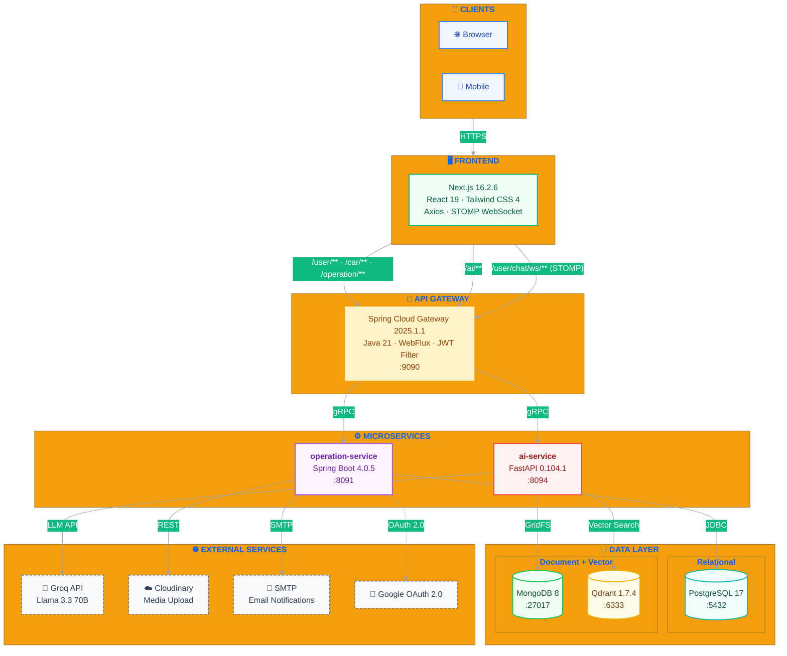
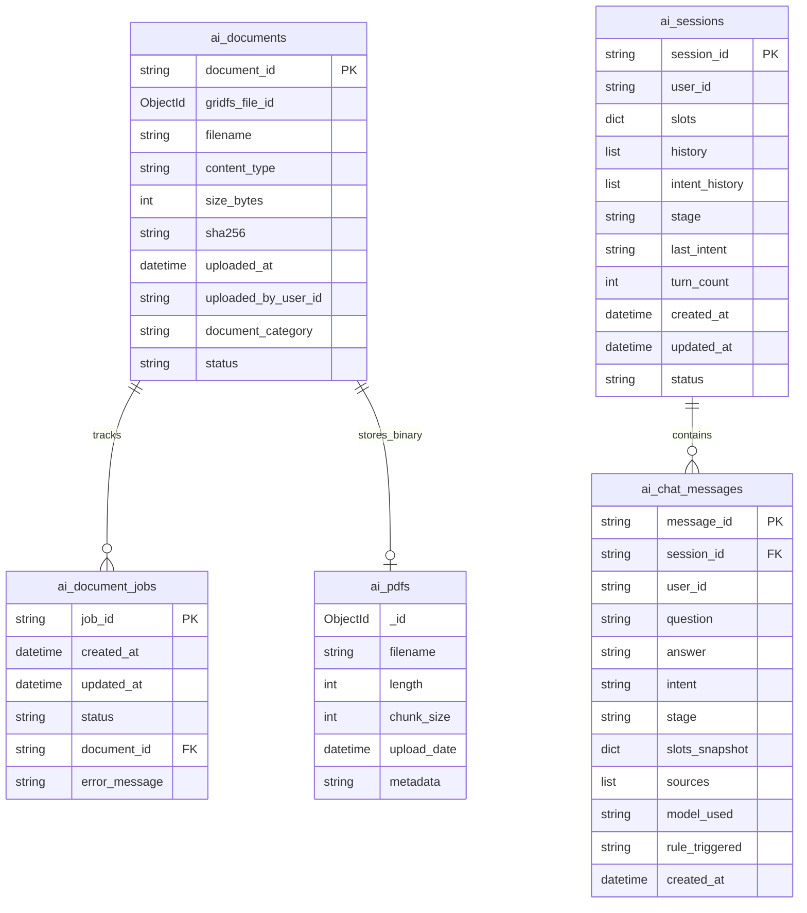

# Tayota — Nền Tảng Quản Lý & Tư Vấn Dịch Vụ Toyota

<div align="center">


**Tayota** là nền tảng web quản lý và tư vấn dịch vụ Toyota theo mô hình microservices, gồm frontend Next.js, backend Spring Boot và AI service FastAPI hỗ trợ RAG để tư vấn xe dựa trên tài liệu PDF.

> **Kiến trúc:** Dự án tách thành ba tiến trình độc lập — `tayota-frontend` (Next.js 16.2.6 App Router), `api-gateway` (Spring Cloud Gateway WebFlux), `operation-service` (Spring Boot 4), và `ai-service` (FastAPI + RAG). Giao tiếp qua HTTP/gRPC và JWT. Dữ liệu quan hệ lưu trong PostgreSQL, document/vector trong MongoDB + Qdrant. Frontend gọi tất cả API qua Gateway tại `:9090`.

[Tính năng](#tính-năng) · [Kiến trúc](#kiến-trúc) · [Cài đặt](#cài-đặt) · [Tài khoản demo](#tài-khoản-demo) · [API Docs](#api-documentation) · [Testing](#testing) · [Deployment](#deployment)

</div>

---

## Tính năng

### Khách hàng

- [x] Đăng ký / Đăng nhập bằng email + mật khẩu (JWT + Refresh Token, HTTP-only cookie)
- [x] Đăng nhập bằng Google OAuth 2.0
- [x] Xác minh email, quên mật khẩu, đổi mật khẩu, quản lý phiên đăng nhập
- [x] Duyệt danh mục xe Toyota theo dòng, phiên bản, thông số kỹ thuật và giá
- [x] Đặt lịch lái thử và bảo dưỡng với giới hạn theo ngày và thời gian tối thiểu
- [x] Chat trực tiếp với tư vấn viên qua WebSocket (STOMP)
- [x] Trợ lý AI tư vấn xe thông minh (RAG từ tài liệu PDF nội bộ)
- [x] Nhận email thông báo khi có cập nhật lịch hẹn
- [x] Gửi đánh giá sau khi hoàn thành dịch vụ (token xác thực, hết hạn tự động)
- [x] Xem thông tin tài khoản và lịch sử dịch vụ

### Tư vấn viên dịch vụ (Service Advisor)

- [x] Tiếp nhận và quản lý lịch hẹn lái thử / bảo dưỡng
- [x] Tạo work order, phân công kỹ thuật viên
- [x] Cập nhật trạng thái work order và gửi thông báo cho khách
- [x] Live chat hỗ trợ khách hàng realtime
- [x] Dashboard cá nhân (lịch hẹn, work orders, thống kê)

### Nhân viên hỗ trợ (Assistant)

- [x] Quản lý danh mục xe và thông tin dòng xe
- [x] Quản lý thông số kỹ thuật, giá và hình ảnh xe
- [x] Hỗ trợ tư vấn viên xử lý yêu cầu khách hàng

### Kỹ thuật viên (Mechanic)

- [x] Nhận và cập nhật trạng thái work order được phân công
- [x] Báo cáo tiến độ sửa chữa qua dashboard
- [x] Thông báo hoàn thành công việc

### Quản lý (Manager)

- [x] Dashboard tổng quan hệ thống (lịch hẹn, work orders, doanh thu)
- [x] Quản lý nhân sự và phân công vai trò
- [x] Quản lý toàn bộ danh mục xe
- [x] Báo cáo thống kê chi tiết theo thời gian

### Quản trị viên (Admin)

- [x] Quản lý tài khoản (xem, cấm/mở cấm, đổi vai trò)
- [x] Dashboard tổng quan hệ thống
- [x] Quản lý tài liệu PDF cho AI (upload, rebuild vector index)
- [x] Xem lịch sử sử dụng AI (session, token usage)

### Hệ thống

- [x] JWT + Refresh Token với thu hồi theo phiên đăng nhập
- [x] RBAC 6 vai trò: ADMIN, MANAGER, SERVICE_ADVISOR, ASSISTANT, MECHANIC, USER
- [x] API Gateway định tuyến thông minh: `/user/**` → operation-service, `/ai/**` → ai-service
- [x] Docker Compose cho toàn bộ hạ tầng (PostgreSQL, MongoDB, Qdrant, Gateway, Services)
- [x] Caching với Caffeine (in-memory) cho operation-service
- [x] Realtime với STOMP WebSocket (live chat) và Server-Sent Events
- [x] gRPC nội bộ giữa Gateway và AI Service
- [x] Email thông báo qua Spring Mail + SMTP
- [x] Upload media lên Cloudinary
- [x] RAG chatbot với Qdrant vector search + Groq LLM (Llama 3.3)
- [x] Unit + integration tests cho operation-service và ai-service

---

## Kiến trúc

### Sơ đồ tổng quan



### Sơ đồ Database

#### PostgreSQL — operation-service

```mermaid
erDiagram
    USER {
        uuid id PK
        string email UK
        string password_hash
        string login_provider
        string provider_user_id
        string role FK
        string status
        timestamp created_at
    }

    CAR_STYLE {
        uuid id PK
        string name
        string description
    }

    CAR_SERIES {
        uuid id PK
        uuid car_style_id FK
        string name
        text description
        timestamp created_at
    }

    CAR_VERSION {
        uuid id PK
        uuid car_series_id FK
        string name
        int sale_percent
        int model_year
        string image_url
        string video_url
        boolean is_visible
        timestamp created_at
    }

    CAR {
        string vin_id PK
        uuid car_version_id FK
        uuid dealership_id FK
        string engine_number
        uuid owner_user_id FK
        string status
        int produced_year
        timestamp created_at
    }

    CAR_PRICE {
        uuid car_version_id FK
        uuid exterior_color_id FK
        uuid interior_color_id FK
        decimal price
        string ex_image_url
        string in_image_url
    }

    CAR_GALLERY {
        uuid id PK
        uuid car_version_id FK
        string image_url
        string caption
    }

    CAR_SPECIFICATION {
        uuid id PK
        uuid car_version_id FK
        string engine
        string transmission
        string fuel_type
        int horsepower
        string dimensions
        decimal fuel_consumption
    }

    EXTERIOR_COLOR {
        uuid id PK
        string name
        string code
        string image_url
    }

    INTERIOR_COLOR {
        uuid id PK
        string name
        string code
    }

    DEALERSHIP {
        uuid id PK
        string name
        string address
        string phone
        float latitude
        float longitude
        string operating_hours
        boolean is_active
        timestamp created_at
    }

    GUEST_INFORMATION {
        uuid id PK
        string full_name
        string email
        string phone
    }

    APPOINTMENT {
        uuid id PK
        uuid user_id FK
        uuid car_version_id FK
        string vin_id
        uuid dealership_id FK
        uuid mechanic_id FK
        uuid guest_information_id FK
        string type
        string status
        timestamp scheduled_start_at
        timestamp scheduled_end_at
        text notes
        timestamp confirmed_at
        timestamp completed_at
        timestamp canceled_at
        timestamp expired_at
        string cancel_reason
        timestamp created_at
        timestamp updated_at
    }

    SERVICE_TICKET {
        uuid id PK
        uuid user_id FK
        uuid guest_information_id FK
        string vin_id
        uuid mechanic_id FK
        uuid dealership_id FK
        uuid appointment_id FK UK
        int mileage_at_service
        string status
        decimal total_amount
        string vehicle_condition
        text notes
        timestamp receiving_at
        timestamp processing_at
        timestamp completed_at
        timestamp canceled_at
        timestamp expired_at
        string cancel_reason
        timestamp created_at
        timestamp updated_at
    }

    SERVICE_ITEM {
        uuid id PK
        uuid service_ticket_id FK
        string item_type
        uuid accessory_id FK
        string item_name
        int quantity
        decimal unit_price
        string billing_type
        decimal final_price
        text note
        timestamp created_at
    }

    CUSTOMER_REVIEW {
        uuid id PK
        string review_type
        string status
        string review_token
        timestamp token_expires_at
        timestamp submitted_at
        uuid appointment_id FK UK
        uuid service_ticket_id FK UK
        uuid user_id FK
        string guest_full_name
        string guest_email
        string guest_phone
        uuid dealership_id FK
        int service_rating
        text service_comment
        uuid mechanic_id FK
        int mechanic_rating
        text mechanic_comment
        timestamp created_at
    }

    CHAT_SESSION {
        uuid id PK
        uuid user_id FK
        string guest_id
        uuid assigned_assistant_id FK
        string status
        timestamp closed_at
        timestamp resolved_at
        timestamp created_at
        timestamp updated_at
    }

    CHAT_MESSAGE {
        uuid id PK
        uuid chat_session_id FK
        uuid sender_id FK
        string sender_type
        string message_type
        text content
        timestamp sent_at
    }

    NOTIFICATION {
        uuid id PK
        uuid user_id FK
        uuid sender_id FK
        string type
        string title
        text content
        boolean is_read
        timestamp read_at
        timestamp created_at
    }

    ACCESSORY {
        uuid id PK
        string model
        string brand
        decimal price
        text description
        text use_content
        text reminder_content
        string type
        string image_url
        boolean is_visible
    }

    SERVICE_TIME_SLOT {
        uuid id PK
        uuid dealership_id FK
        time start_time
        time end_time
        int capacity
        boolean is_active
    }

    USER ||--o{ CHAT_SESSION : "owns"
    USER ||--o{ APPOINTMENT : "books"
    USER ||--o{ SERVICE_TICKET : "requests"
    USER ||--o{ NOTIFICATION : "receives"
    USER ||--o{ CHAT_MESSAGE : "sends"
    USER ||--o{ CAR : "owns"

    CAR_STYLE ||--o{ CAR_SERIES : "defines"
    CAR_SERIES ||--o{ CAR_VERSION : "produces"
    CAR_VERSION ||--o{ CAR : "installed on"
    CAR_VERSION ||--o{ CAR_PRICE : "priced at"
    CAR_VERSION ||--o{ CAR_GALLERY : "galleries"
    CAR_VERSION ||--o{ CAR_SPECIFICATION : "specs"

    DEALERSHIP ||--o{ CAR : "stocks"
    DEALERSHIP ||--o{ APPOINTMENT : "hosts"
    DEALERSHIP ||--o{ SERVICE_TICKET : "handles"
    DEALERSHIP ||--o{ SERVICE_TIME_SLOT : "defines"

    GUEST_INFORMATION ||--o{ APPOINTMENT : "references"
    GUEST_INFORMATION ||--o{ SERVICE_TICKET : "references"

    APPOINTMENT ||--o| SERVICE_TICKET : "generates"
    APPOINTMENT ||--o| CUSTOMER_REVIEW : "triggers"
    APPOINTMENT ||--o| USER : "booked_by"

    SERVICE_TICKET ||--o| CUSTOMER_REVIEW : "triggers"
    SERVICE_TICKET ||--o{ SERVICE_ITEM : "contains"
    SERVICE_TICKET ||--o| USER : "requested_by"

    SERVICE_ITEM }o--|| ACCESSORY : "references"

    CHAT_SESSION ||--o{ CHAT_MESSAGE : "contains"
    CHAT_SESSION }o--|| USER : "assigned_assistant"
```

#### MongoDB — ai-service



### Chiến lược Rendering (Next.js)

| Route | Chiến lược | Lý do |
|-------|-----------|-------|
| `/` (Landing) | SSR + cache ngắn | SEO và first-paint |
| `/cars` | ISR | Danh mục xe ít thay đổi |
| `/cars/[series]` | SSR | Chi tiết dòng xe động |
| `/appointments` | SSR `force-dynamic` | Dữ liệu cá nhân, không cache |
| `/chat` | Client-side | Realtime WebSocket |
| `/ai-consultant` | Client-side | Tương tác AI realtime |
| `/admin/*`, `/manager/*` | SSR `force-dynamic` | Dashboard cá nhân |

### Cấu trúc thư mục

```
Tayota/
├── tayota-frontend/                  # Next.js 16.2.6 (App Router)
│   ├── src/
│   │   ├── app/                     # App Router pages
│   │   │   ├── (public)/           # Landing, car catalog, login, register
│   │   │   ├── appointments/
│   │   │   ├── chat/
│   │   │   ├── ai-consultant/
│   │   │   ├── admin/
│   │   │   └── manager/
│   │   ├── components/
│   │   │   ├── layout/              # Header, Footer
│   │   │   ├── cars/               # Car cards, specs, gallery
│   │   │   ├── appointments/
│   │   │   ├── chat/
│   │   │   ├── ai/
│   │   │   └── ui/                  # Shared UI components
│   │   ├── lib/                    # API client, WebSocket, helpers
│   │   └── types/
│   ├── Dockerfile
│   ├── next.config.ts
│   └── package.json
│
├── tayota-backend/
│   ├── docker-compose.yml           # Full infrastructure + services
│   ├── docker-compose.test.yml     # Test profile
│   └── docker-data/                 # Local data volumes
│
│   ├── api-gateway/                 # Spring Cloud Gateway WebFlux
│   │   ├── src/main/java/com/tayota/apigateway/
│   │   │   ├── config/             # CORS, routes, JWT filter
│   │   │   └── filter/             # Gateway filters, authentication
│   │   ├── src/main/resources/application.yml
│   │   ├── pom.xml
│   │   └── Dockerfile
│
│   ├── operation-service/           # Spring Boot 4 — nghiệp vụ chính
│   │   ├── src/main/java/com/tayota/operationservice/
│   │   │   ├── controller/         # REST + WebSocket controllers
│   │   │   ├── service/            # Business logic
│   │   │   ├── repository/         # JPA repositories
│   │   │   ├── entity/             # PostgreSQL entities
│   │   │   ├── dto/                # Request/Response DTOs
│   │   │   ├── mapper/             # Entity <-> DTO mapping
│   │   │   └── config/             # Security, JWT, WebSocket, Kafka, Cache
│   │   ├── src/main/resources/
│   │   │   ├── schema.sql          # Database schema
│   │   │   ├── data.sql            # Seed data (demo accounts)
│   │   │   └── application.properties
│   │   ├── pom.xml
│   │   └── Dockerfile
│
│   └── ai-service/                  # FastAPI — RAG chatbot
│       ├── app.py                  # API routes, middleware, health
│       ├── rag.py                  # Retrieval + generation pipeline
│       ├── vector_database.py      # Qdrant operations
│       ├── mongo_storage.py        # MongoDB/GridFS file storage
│       ├── conversation_state_manager.py
│       ├── documents/              # PDF source for RAG
│       ├── tests/
│       ├── requirements.txt
│       └── Dockerfile
│
├── README.md
└── LICENSE
```

---

## Tech Stack

| Layer | Công nghệ |
|-------|-----------|
| Frontend | Next.js 16.2.6 (App Router), React 19.2.4, Tailwind CSS 4 |
| HTTP Client | Axios |
| Realtime | STOMP over WebSocket (frontend), Spring WebSocket (backend) |
| API Gateway | Java 21, Spring Boot 4.0.5, Spring Cloud Gateway 2025.1.1 WebFlux |
| Auth (Gateway) | JJWT 0.12.6, JWT stateless validation |
| Operation Service | Java 21, Spring Boot 4.0.5, Spring Security, Spring Data JPA |
| Database | PostgreSQL 17, JPA/Hibernate |
| Cache | Caffeine (in-memory) |
| WebSocket | Spring WebSocket + STOMP |
| AI Service | Python 3.11, FastAPI 0.104.1, Uvicorn |
| Vector DB | Qdrant 1.7.4 |
| Document Store | MongoDB 8, GridFS |
| Embedding | sentence-transformers 3.0.1 |
| LLM | Groq API (Llama 3.3 70B Versatile) |
| Upload | Cloudinary 2.3.2 |
| Email | Spring Mail + SMTP |
| Container | Docker Compose |
| Testing | JUnit 5, Mockito, H2 (in-memory), pytest |
| gRPC | Spring gRPC 1.0.2, gRPC Java 1.77.1, Protobuf 4.33.4 |

---

## Yêu cầu

- **Docker Desktop** hoặc Docker Engine + Docker Compose
- **Node.js** 20+ và **npm** 10+ (nếu chạy frontend trên host)
- **Java** 21 và **Maven** (nếu chạy Spring service riêng lẻ)
- **Python** 3.11 (nếu chạy AI service riêng lẻ)

---

## Cài đặt

### 1. Clone dự án

```bash
git clone <repo-url>
cd Tayota
```

### 2. Tạo file môi trường

```powershell
# Windows PowerShell
cd tayota-backend
Copy-Item .env.example .env
```

Hoặc tạo file `.env` trong `tayota-backend/` với các biến sau:

```env
# ─── Ports ───
API_GATEWAY_PORT=9090
OPERATION_SERVICE_PORT=8091
AI_SERVICE_PORT=8094
FRONTEND_ORIGINS=http://localhost:3000

# ─── PostgreSQL ───
POSTGRES_USER=tayota
POSTGRES_PASSWORD=123456
POSTGRES_OPERATION_DB=tayota_operation_db

# ─── MongoDB ───
MONGO_USER=tayota
MONGO_PASSWORD=123456
MONGO_AI_DB=tayota_ai_db

# ─── JWT ───
JWT_SECRET=change-me-to-a-long-random-secret
GATEWAY_INTERNAL_SECRET=change-me-gateway-internal-secret

# ─── AI / LLM ───
LLM_PROVIDER=groq
GROQ_API_KEY=
GROQ_MODEL=llama-3.3-70b-versatile

# ─── Email (SMTP) ───
MAIL_HOST=smtp.gmail.com
MAIL_PORT=587
MAIL_USERNAME=
MAIL_PASSWORD=

# ─── Cloudinary ───
CLOUDINARY_CLOUD_NAME=
CLOUDINARY_API_KEY=
CLOUDINARY_API_SECRET=
CLOUDINARY_FOLDER_PREFIX=tayota

# ─── Qdrant ───
QDRANT_API_KEY=
```

> **Redis local:** Docker Compose tự khởi tạo PostgreSQL, MongoDB và Qdrant trong network nội bộ. Các biến AI/Groq/Cloudinary/SMTP có thể để trống khi dev — AI fallback sang mock mode, email log ra console.

### 3. Chạy ứng dụng

**Cách A — Backend qua Docker, frontend chạy local** *(khuyến nghị khi dev)*

```powershell
cd tayota-backend
docker compose up --build -d

# Load tài liệu AI cơ bản (tùy chọn)
docker compose exec ai-service python vector_database.py --rebuild --pdf-path /app/documents

# Terminal mới
cd tayota-frontend
npm ci
npm run dev
```

| Dịch vụ | URL |
|---------|-----|
| Frontend | http://localhost:3000 |
| API Gateway | http://localhost:9090 |
| AI Service | http://localhost:8094 |
| Qdrant Dashboard | http://localhost:6333 |
| PostgreSQL (host) | localhost:5432 |
| MongoDB (host) | localhost:27017 |

**Cách B — Toàn bộ qua Docker Compose**

```powershell
cd tayota-frontend
docker build -t tayota-frontend .

cd ../tayota-backend
docker compose up -d
```

> Frontend Dockerfile hiện chạy độc lập với Compose. Để tích hợp, bổ sung service `frontend` vào `docker-compose.yml` và cập nhật `FRONTEND_ORIGINS`.

```powershell
# Xem logs
docker compose logs -f api-gateway operation-service ai-service
```

**Cách C — Chạy hoàn toàn local (không Docker)**

```powershell
# Terminal 1 — API Gateway
cd tayota-backend/api-gateway
./mvnw spring-boot:run

# Terminal 2 — Operation Service
cd tayota-backend/operation-service
./mvnw spring-boot:run

# Terminal 3 — AI Service
cd tayota-backend/ai-service
python -m venv .venv
.\.venv\Scripts\Activate.ps1
pip install -r requirements.txt
uvicorn app:app --reload --port 8094

# Terminal 4 — Frontend
cd tayota-frontend
npm ci
npm run dev
```

Yêu cầu có PostgreSQL 17, MongoDB 8, Qdrant 1.7.4 chạy local.

---

## Tài khoản demo

`operation-service` tự động seed các tài khoản demo khi khởi động (thông qua `data.sql`).

> **Mật khẩu mặc định:** `Tayota@123`

| Vai trò | Email | Mô tả |
|---------|-------|-------|
| Quản trị viên | `admin.demo@tayota.com` | Toàn quyền hệ thống |
| Quản lý | `manager.demo@tayota.com` | Dashboard, nhân sự, danh mục xe |
| Tư vấn viên | `advisor.demo@tayota.com` | Tiếp nhận lịch hẹn, tạo work order |
| Nhân viên hỗ trợ | `assistant.demo@tayota.com` | Quản lý danh mục xe, hỗ trợ tư vấn viên |
| Kỹ thuật viên | `mechanic.demo@tayota.com` | Nhận và cập nhật work order |
| Khách hàng | `customer.demo@tayota.com` | Đặt lịch, chat, đánh giá |

---

## API Documentation

### Gateway Routes

| Method | Endpoint | Backend | Mô tả | Auth |
|--------|----------|---------|-------|------|
| POST | `/user/api/v1/auth/register` | operation-service | Đăng ký tài khoản | — |
| POST | `/user/api/v1/auth/login` | operation-service | Đăng nhập | — |
| POST | `/user/api/v1/auth/refresh` | operation-service | Refresh token | — |
| GET | `/user/api/v1/auth/me` | operation-service | Thông tin user hiện tại | User |
| POST | `/user/api/v1/auth/google` | operation-service | Google OAuth | — |
| GET | `/user/api/v1/auth/google/callback` | operation-service | OAuth callback | — |
| GET | `/user/api/v1/users/{id}` | operation-service | Chi tiết user | User |
| GET | `/car/api/v1/series` | operation-service | Danh sách dòng xe | — |
| GET | `/car/api/v1/series/{id}` | operation-service | Chi tiết dòng xe | — |
| GET | `/car/api/v1/cars` | operation-service | Danh sách xe | — |
| GET | `/car/api/v1/cars/{id}` | operation-service | Chi tiết xe + thông số | — |
| POST | `/operation/api/v1/appointments` | operation-service | Tạo lịch hẹn | User |
| GET | `/operation/api/v1/appointments` | operation-service | Danh sách lịch hẹn | User/Staff |
| PATCH | `/operation/api/v1/appointments/{id}` | operation-service | Cập nhật trạng thái | Staff |
| POST | `/operation/api/v1/workorders` | operation-service | Tạo work order | Staff |
| GET | `/operation/api/v1/workorders` | operation-service | Danh sách work order | Staff |
| PATCH | `/operation/api/v1/workorders/{id}` | operation-service | Cập nhật work order | Mechanic |
| GET | `/ai/api/v1/health` | ai-service | Health check AI | — |
| POST | `/ai/api/v1/chat` | ai-service | Chat RAG | User/Guest |
| GET | `/ai/api/v1/documents` | ai-service | Danh sách tài liệu | Admin |
| POST | `/ai/api/v1/documents/upload` | ai-service | Upload PDF | Admin |
| POST | `/ai/api/v1/documents/rebuild-index` | ai-service | Rebuild vector index | Admin |

### WebSocket

| Path | Mô tả | Auth |
|------|-------|------|
| `/user/chat/ws` | Live chat khách hàng ↔ tư vấn viên (STOMP) | User/Staff |

### AI Chat Endpoints

| Method | Endpoint | Mô tả | Auth |
|--------|----------|-------|------|
| POST | `/ai/api/v1/chat` | Gửi tin nhắn chat RAG | User/Guest |
| GET | `/ai/api/v1/users/{userId}/sessions` | Lịch sử session | User |
| GET | `/ai/api/v1/sessions/{sessionId}/messages` | Tin nhắn trong session | User |

### Admin Endpoints

| Method | Endpoint | Mô tả | Auth |
|--------|----------|-------|------|
| GET | `/operation/api/v1/admin/stats` | Thống kê hệ thống | Admin |
| GET | `/operation/api/v1/admin/users` | Danh sách người dùng | Admin |
| PATCH | `/operation/api/v1/admin/users/{id}/role` | Đổi vai trò | Admin |
| PATCH | `/operation/api/v1/admin/users/{id}/status` | Cấm/mở cấm | Admin |
| GET | `/ai/api/v1/admin/usage` | Lịch sử sử dụng AI | Admin |

---

## Testing

### Operation Service

```powershell
cd tayota-backend/operation-service
./mvnw test

# Với coverage
./mvnw test jacoco:report
```

Hoặc qua Docker Compose profile test:

```powershell
cd tayota-backend
docker compose -f docker-compose.test.yml --profile test up --build --abort-on-container-exit
```

### API Gateway

```powershell
cd tayota-backend/api-gateway
./mvnw test
```

### AI Service

```powershell
cd tayota-backend/ai-service
python -m venv .venv
.\.venv\Scripts\Activate.ps1
pip install -r requirements.txt
pytest -v
```

### Frontend

```powershell
cd tayota-frontend
npm run lint
npm run build
```

---

## Deployment

| Thành phần | Nhà cung cấp | Ghi chú |
|------------|--------------|---------|
| Frontend | **Vercel / Render** | Next.js static/SSR |
| API Gateway | **Render** | Spring Boot JAR |
| Operation Service | **Render** | Spring Boot JAR |
| AI Service | **Render / Railway** | FastAPI + Python |
| Database | **PostgreSQL** (Render addon hoặc Neon) | PostgreSQL 17 |
| Vector DB | **Qdrant Cloud** | v1.7.4+ |
| Document Store | **MongoDB Atlas** | M0 (Free tier) |
| LLM | **Groq API** | Llama 3.3 70B |
| Media | **Cloudinary** | Image/video upload |
| Email | **Gmail SMTP** hoặc **Brevo** | App Password |

### Render Deployment Checklist

1. **API Gateway** → New Web Service → JAR upload → Port `9090` → Health check `/actuator/health`
2. **Operation Service** → New Web Service → JAR upload → Port `8091` → Health check `/actuator/health`
3. **AI Service** → New Background Service → `uvicorn app:app --host 0.0.0.0 --port $PORT`

Biến môi trường bắt buộc cho production:

```env
# ─── Security ───
JWT_SECRET=<chuỗi-ngẫu-nhiên-mạnh-32+>
GATEWAY_INTERNAL_SECRET=<secret-nội-bộ-gateway>
COOKIE_SECURE=true
COOKIE_SAME_SITE=Strict

# ─── Database ───
SPRING_DATASOURCE_URL=jdbc:postgresql://<host>:<port>/tayota_operation_db
SPRING_DATASOURCE_USERNAME=<user>
SPRING_DATASOURCE_PASSWORD=<password>

# ─── AI ───
GROQ_API_KEY=<key>
QDRANT_URL=https://<region>.qdrant.tech
QDRANT_API_KEY=<key>
MONGO_URI=mongodb+srv://<user>:<pass>@<cluster>.mongodb.net/tayota_ai_db

# ─── Frontend Origin ───
FRONTEND_ORIGINS=https://your-frontend.vercel.app
```

> Backend có validation lúc khởi động — sẽ cảnh báo nếu `JWT_SECRET` yếu hoặc `COOKIE_SECURE=false` trong production.

---

## License

MIT License — xem file [LICENSE](LICENSE).

---

## Authors

Tayota Development Team
