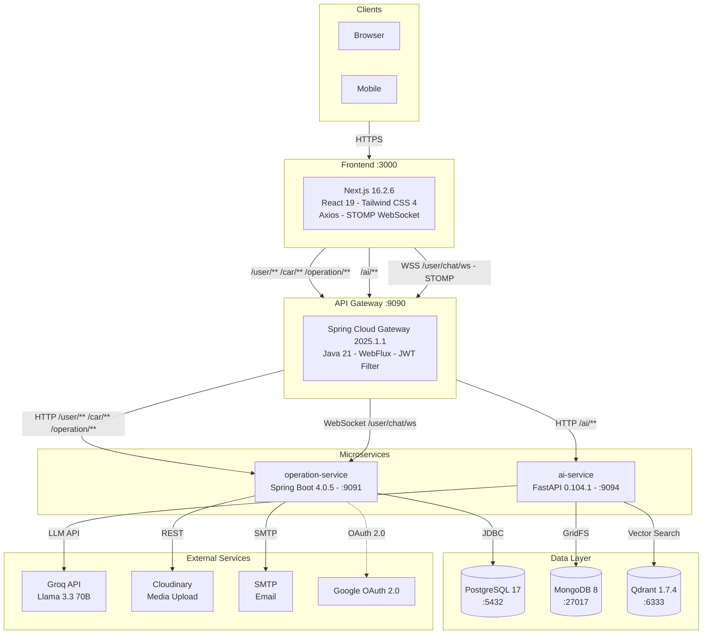
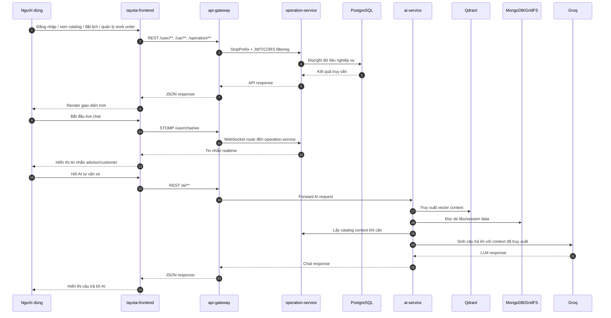
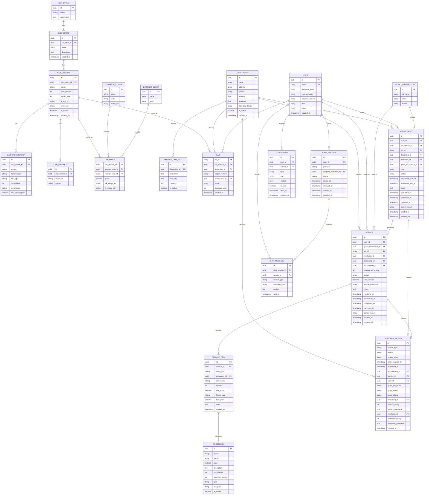
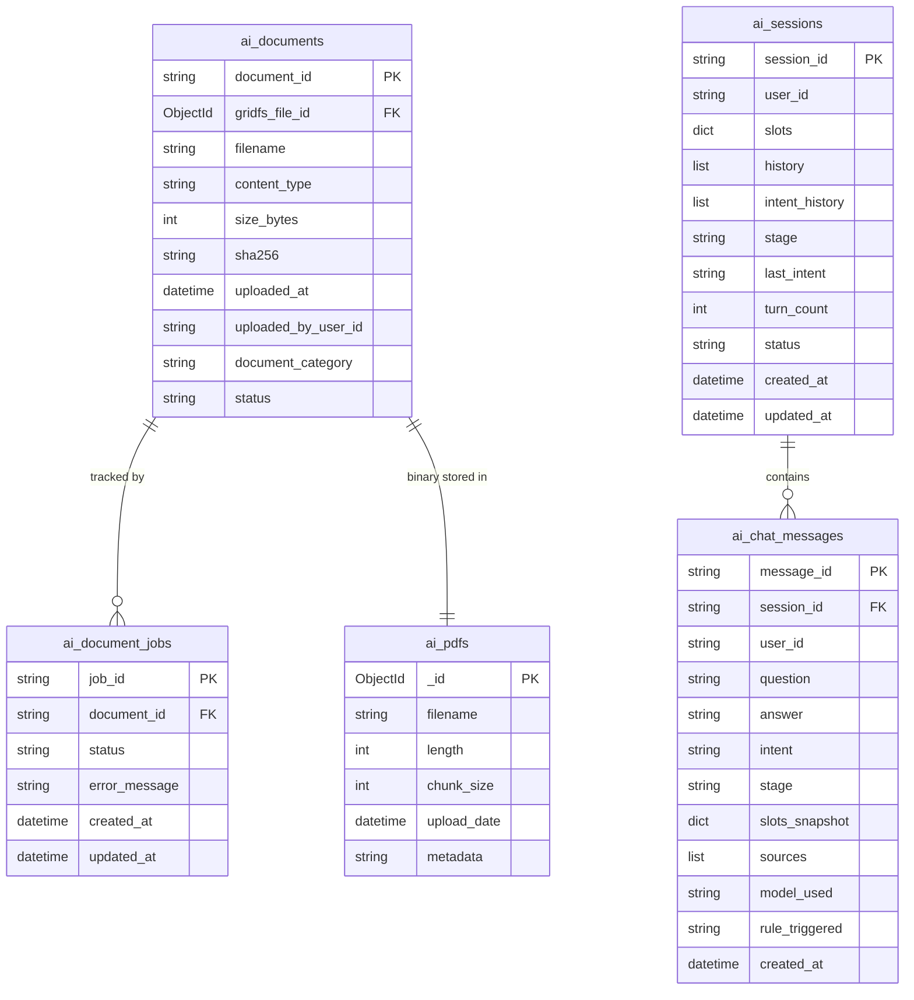

# Tayota — Nền tảng quản lý dịch vụ và tư vấn Toyota

> Ngôn ngữ: [English](README.md) | **Tiếng Việt**

<div align="center">


**Tayota** là nền tảng microservices phục vụ quản lý dịch vụ và tư vấn Toyota, gồm frontend Next.js, backend Spring Boot và service AI FastAPI dùng RAG để tư vấn xe từ tài liệu PDF.

[Tính năng](#tính-năng) · [Kiến trúc](#kiến-trúc) · [Cài đặt](#cài-đặt) · [Tài khoản demo](#tài-khoản-demo) · [Tài liệu API](#tài-liệu-api) · [Kiểm thử](#kiểm-thử) · [Triển khai](#triển-khai)

</div>

---

## Mục lục

- [Tính năng](#tính-năng)
- [Kiến trúc](#kiến-trúc)
  - [Tổng quan hệ thống](#tổng-quan-hệ-thống)
  - [Luồng xử lý chính](#luồng-xử-lý-chính)
  - [Database Schema](#database-schema)
  - [Chiến lược render Frontend](#chiến-lược-render-frontend)
  - [Cấu trúc dự án](#cấu-trúc-dự-án)
- [Tech Stack](#tech-stack)
- [Yêu cầu](#yêu-cầu)
- [Cài đặt](#cài-đặt)
- [Tài khoản demo](#tài-khoản-demo)
- [Tài liệu API](#tài-liệu-api)
- [Kiểm thử](#kiểm-thử)
- [Triển khai](#triển-khai)
- [License](#license)

---

## Tính năng

### Khách hàng (USER)
- Đăng ký và đăng nhập bằng email/mật khẩu (JWT + Refresh Token qua HTTP-only cookie).
- Đăng nhập Google OAuth 2.0.
- Xác minh email, quên/đổi mật khẩu và quản lý phiên đăng nhập.
- Xem catalog xe Toyota theo dòng xe, phiên bản, thông số và giá.
- Đặt lịch lái thử và lịch bảo dưỡng với giới hạn theo ngày và thời gian báo trước tối thiểu.
- Chat trực tiếp với advisor qua WebSocket (STOMP).
- Tư vấn xe bằng AI RAG từ tài liệu PDF nội bộ.
- Nhận email thông báo khi lịch hẹn thay đổi.
- Gửi đánh giá sau khi hoàn tất dịch vụ qua token tự hết hạn.
- Xem thông tin tài khoản và lịch sử dịch vụ.

### Service Advisor
- Tiếp nhận và quản lý lịch lái thử/bảo dưỡng.
- Tạo work order và phân công mechanic.
- Cập nhật trạng thái work order và gửi thông báo cho khách hàng.
- Hỗ trợ khách hàng qua live chat realtime.
- Dashboard cá nhân cho lịch hẹn, work order và thống kê.

### Assistant
- Quản lý catalog xe và thông tin model.
- Quản lý thông số, giá và hình ảnh xe.
- Hỗ trợ advisor xử lý yêu cầu của khách hàng.

### Mechanic
- Nhận và cập nhật trạng thái work order được phân công.
- Báo cáo tiến độ sửa chữa qua dashboard.
- Gửi thông báo khi hoàn tất công việc.

### Manager
- Dashboard tổng quan hệ thống: lịch hẹn, work order, doanh thu.
- Quản lý nhân sự và phân quyền.
- Quản lý toàn bộ catalog xe.
- Thống kê và báo cáo chi tiết theo thời gian.

### Admin
- Quản lý tài khoản: xem, khóa/mở khóa, đổi vai trò.
- Dashboard tổng quan hệ thống.
- Quản lý tài liệu AI: upload PDF, rebuild vector index.
- Xem lịch sử sử dụng AI: phiên chat, token usage.

### Hệ thống
- JWT + Refresh Token với khả năng thu hồi theo từng phiên.
- RBAC với 6 vai trò: `ADMIN`, `MANAGER`, `SERVICE_ADVISOR`, `ASSISTANT`, `MECHANIC`, `USER`.
- API Gateway định tuyến thông minh: `/user/**`, `/car/**`, `/operation/**` -> operation-service; `/ai/**` -> ai-service.
- Docker Compose cho toàn bộ hạ tầng: PostgreSQL, MongoDB, Qdrant, Gateway và các service.
- Cache in-memory bằng Caffeine cho operation-service.
- Realtime qua STOMP WebSocket (live chat) và Server-Sent Events.
- Gateway giao tiếp với service bằng HTTP và WebSocket theo `application.yml`.
- Gửi email qua Spring Mail + SMTP.
- Upload media lên Cloudinary.
- Chatbot RAG với Qdrant vector search + Groq LLM (Llama 3.3).
- Unit test và integration test cho operation-service và ai-service.

---

## Kiến trúc

### Tổng quan hệ thống

Dự án được tách thành bốn tiến trình độc lập: `tayota-frontend` (Next.js), `api-gateway` (Spring Cloud Gateway WebFlux), `operation-service` (Spring Boot 4) và `ai-service` (FastAPI + RAG). Tất cả API từ frontend đi qua Gateway ở port `:9090`.



**Tóm tắt giao tiếp:**

| Từ | Đến | Giao thức |
|------|----|----------|
| Browser / Mobile | Frontend | HTTPS |
| Frontend | API Gateway | HTTPS / WSS (STOMP) |
| API Gateway | operation-service | HTTP / WebSocket |
| API Gateway | ai-service | HTTP |
| operation-service | PostgreSQL | JDBC |
| operation-service | Cloudinary | REST |
| operation-service | SMTP | SMTP |
| operation-service | Google | OAuth 2.0 |
| ai-service | MongoDB | GridFS |
| ai-service | Qdrant | REST |
| ai-service | Groq | REST |

---

### Luồng xử lý chính



---

### Database Schema

#### PostgreSQL — operation-service

Schema quan hệ đầy đủ cho authentication, catalog xe, lịch hẹn, work order, review, live chat và notification.



---

#### MongoDB — ai-service

Các collection phục vụ quản lý tài liệu AI, phiên chat RAG và job xử lý.



> **Vector storage (Qdrant):** Các chunk PDF được embedding bằng `sentence-transformers` và lưu trong Qdrant. Mỗi vector point liên kết về `document_id` trong MongoDB để truy vết citation khi RAG retrieval.

---

### Chiến lược render Frontend

| Route | Chiến lược | Lý do |
|-------|------------|-------|
| `/` (Landing) | SSR + cache ngắn | SEO và first paint |
| `/vehicles` | SSR / dynamic fetch | Catalog xe với dữ liệu lọc động |
| `/vehicles/[id]` | SSR | Chi tiết xe, thông số, thư viện ảnh và phụ kiện |
| `/appointments/*` | SSR + client forms | Đặt lịch lái thử và lịch dịch vụ |
| `/support/live-chat` | Client-side | Live chat realtime qua WebSocket |
| `#ai-chat` widget | Client-side | Trợ lý AI nổi trong layout ứng dụng |
| `/dashboard/*` | SSR `force-dynamic` + client panels | Dashboard cá nhân theo vai trò |

---

### Cấu trúc dự án

```text
Tayota/
├── tayota-frontend/                  # Next.js 16.2.6 (App Router)
│   ├── src/
│   │   ├── app/
│   │   │   ├── appointments/
│   │   │   ├── auth/
│   │   │   ├── compare/
│   │   │   ├── dashboard/
│   │   │   ├── dealerships/
│   │   │   ├── news/
│   │   │   ├── notifications/
│   │   │   ├── reviews/
│   │   │   ├── support/live-chat/
│   │   │   ├── vehicles/
│   │   │   └── verify-account/
│   │   ├── components/
│   │   │   ├── layout/              # Header, Footer
│   │   │   ├── vehicles/            # Card xe, thông số, thư viện ảnh
│   │   │   ├── appointments/
│   │   │   ├── chat/
│   │   │   ├── dashboard/
│   │   │   ├── notifications/
│   │   │   └── reviews/
│   │   ├── lib/                     # API client, WebSocket, helpers
│   │   └── types/
│   ├── Dockerfile
│   ├── next.config.mjs
│   └── package.json
│
├── tayota-backend/
│   ├── docker-compose.yml           # Full infrastructure + services
│   ├── docker-compose.test.yml      # Test profile
│   └── docker-data/                 # Local data volumes
│
│   ├── api-gateway/                 # Spring Cloud Gateway WebFlux
│   │   ├── src/main/java/com/tayota/apigateway/
│   │   │   ├── config/              # CORS, routes, JWT filter
│   │   │   └── filter/              # Gateway filters, authentication
│   │   ├── src/main/resources/application.yml
│   │   ├── pom.xml
│   │   └── Dockerfile
│
│   ├── operation-service/           # Spring Boot 4 — core business logic
│   │   ├── src/main/java/com/tayota/operationservice/
│   │   │   ├── controller/          # REST + WebSocket controllers
│   │   │   ├── service/             # Business logic
│   │   │   ├── repository/          # JPA repositories
│   │   │   ├── entity/              # PostgreSQL entities
│   │   │   ├── dto/                 # Request/Response DTOs
│   │   │   ├── mapper/              # Entity <-> DTO mapping
│   │   │   └── config/              # Security, JWT, WebSocket, Cache
│   │   ├── src/main/resources/
│   │   │   ├── schema.sql           # Database schema
│   │   │   ├── data.sql             # Seed data (demo accounts)
│   │   │   └── application.properties
│   │   ├── pom.xml
│   │   └── Dockerfile
│
│   └── ai-service/                  # FastAPI — RAG chatbot
│       ├── app.py                   # API routes, middleware, health
│       ├── rag.py                   # Retrieval + generation pipeline
│       ├── vector_database.py       # Qdrant operations
│       ├── mongo_storage.py         # MongoDB/GridFS file storage
│       ├── conversation_state_manager.py
│       ├── documents/               # PDF source for RAG
│       ├── tests/
│       ├── requirements.txt
│       └── Dockerfile
│
├── README.md
└── LICENSE
```

---

## Tech Stack

| Layer | Technology |
|-------|------------|
| **Frontend** | Next.js 16.2.6 (App Router), React 19.2.4, Tailwind CSS 4 |
| **HTTP Client** | Axios |
| **Realtime** | STOMP over WebSocket (frontend), Spring WebSocket (backend) |
| **API Gateway** | Java 21, Spring Boot 4.0.5, Spring Cloud Gateway 2025.1.1 WebFlux |
| **Auth** | JJWT 0.12.6, JWT stateless validation |
| **Operation Service** | Java 21, Spring Boot 4.0.5, Spring Security, Spring Data JPA |
| **Relational DB** | PostgreSQL 17, JPA/Hibernate |
| **Cache** | Caffeine (in-memory) |
| **AI Service** | Python 3.11, FastAPI 0.104.1, Uvicorn |
| **Vector DB** | Qdrant 1.7.4 |
| **Document Store** | MongoDB 8, GridFS |
| **Embeddings** | sentence-transformers 3.0.1 |
| **LLM** | Groq API (Llama 3.3 70B Versatile) |
| **Media Upload** | Cloudinary 2.3.2 |
| **Email** | Spring Mail + SMTP |
| **Containerization** | Docker Compose |
| **Testing** | JUnit 5, Mockito, H2 (in-memory), pytest |
| **Service Routing** | Spring Cloud Gateway routes HTTP/WebSocket |

---

## Yêu cầu

- **Docker Desktop** hoặc Docker Engine + Docker Compose.
- **Node.js** 20+ và **npm** 10+ nếu chạy frontend trên host.
- **Java** 21 và **Maven** nếu chạy Spring services độc lập.
- **Python** 3.11 nếu chạy AI service độc lập.

---

## Cài đặt

### 1. Clone repository

```bash
git clone <repo-url>
cd Tayota
```

### 2. Cấu hình biến môi trường

```bash
cd tayota-backend
cp .env.example .env   # Linux/macOS
# Windows PowerShell: Copy-Item .env.example .env
```

Chỉnh `.env` với giá trị của bạn:

```env
# ─── Ports ───
API_GATEWAY_PORT=9090
OPERATION_SERVICE_PORT=9091
AI_SERVICE_PORT=9094
FRONTEND_ORIGINS=http://localhost:3000

# ─── PostgreSQL ───
POSTGRES_USER=tayota
POSTGRES_PASSWORD=123456
POSTGRES_OPERATION_DB=tayota_operation_db

# ─── MongoDB ───
MONGO_USER=tayota
MONGO_PASSWORD=123456
MONGO_AI_DB=tayota_ai_db

# ─── JWT ───
JWT_SECRET=change-me-to-a-long-random-secret
GATEWAY_INTERNAL_SECRET=change-me-gateway-internal-secret

# ─── AI / LLM ───
LLM_PROVIDER=groq
GROQ_API_KEY=
GROQ_MODEL=llama-3.3-70b-versatile

# ─── Email (SMTP) ───
MAIL_HOST=smtp.gmail.com
MAIL_PORT=587
MAIL_USERNAME=
MAIL_PASSWORD=

# ─── Cloudinary ───
CLOUDINARY_CLOUD_NAME=
CLOUDINARY_API_KEY=
CLOUDINARY_API_SECRET=
CLOUDINARY_FOLDER_PREFIX=tayota

# ─── Qdrant ───
QDRANT_API_KEY=
```

> **Ghi chú:** Docker Compose tự provision PostgreSQL, MongoDB và Qdrant trong internal network. Các biến AI/Groq/Cloudinary/SMTP có thể để trống khi phát triển local nếu chưa dùng các tích hợp đó.

### 3. Chạy ứng dụng

**Option A — Backend bằng Docker, frontend trên host** *(khuyến nghị cho development)*

```bash
cd tayota-backend
docker compose up --build -d

# Tùy chọn: nạp tài liệu AI vào vector index
docker compose exec ai-service python vector_database.py --rebuild --pdf-path /app/documents

# Terminal mới
cd tayota-frontend
npm ci
npm run dev
```

| Service | URL |
|---------|-----|
| Frontend | http://localhost:3000 |
| API Gateway | http://localhost:9090 |
| AI Service | http://localhost:9094 |
| Qdrant Dashboard | http://localhost:6333 |
| PostgreSQL | localhost:5432 |
| MongoDB | localhost:27017 |

**Option B — Docker hóa toàn bộ**

```bash
cd tayota-frontend
docker build -t tayota-frontend .

cd ../tayota-backend
docker compose up -d

# Theo dõi logs
docker compose logs -f api-gateway operation-service ai-service
```

> `Dockerfile` của frontend chạy độc lập với Compose. Nếu muốn tích hợp, thêm service `frontend` vào `docker-compose.yml` và cập nhật `FRONTEND_ORIGINS`.

**Option C — Chạy local hoàn toàn không dùng Docker**

```bash
# Terminal 1 — API Gateway
cd tayota-backend/api-gateway && ./mvnw spring-boot:run

# Terminal 2 — Operation Service
cd tayota-backend/operation-service && ./mvnw spring-boot:run

# Terminal 3 — AI Service
cd tayota-backend/ai-service
python -m venv .venv
source .venv/bin/activate      # Windows: .\.venv\Scripts\Activate.ps1
pip install -r requirements.txt
uvicorn app:app --reload --port 9094

# Terminal 4 — Frontend
cd tayota-frontend && npm ci && npm run dev
```

Cần PostgreSQL 17, MongoDB 8 và Qdrant 1.7.4 đang chạy local.

---

## Tài khoản demo

`operation-service` tự seed tài khoản demo khi khởi động qua `data.sql`.

> **Mật khẩu mặc định:** `Tayota@123`

| Vai trò | Email | Mô tả |
|------|-------|-------|
| Admin | `admin.demo@tayota.com` | Toàn quyền hệ thống |
| Manager | `manager.demo@tayota.com` | Dashboard, nhân sự, catalog xe |
| Service Advisor | `advisor.demo@tayota.com` | Tiếp nhận lịch hẹn, tạo work order |
| Assistant | `assistant.demo@tayota.com` | Quản lý catalog, hỗ trợ advisor |
| Mechanic | `mechanic.demo@tayota.com` | Nhận và cập nhật work order |
| Customer | `customer.demo@tayota.com` | Đặt lịch, chat, đánh giá |

---

## Tài liệu API

### Gateway Routes

| Method | Endpoint | Service | Mô tả | Auth |
|--------|----------|---------|-------|------|
| POST | `/user/register` | operation-service | Đăng ký tài khoản | — |
| POST | `/user/login` | operation-service | Đăng nhập | — |
| POST | `/user/refresh-token` | operation-service | Refresh token | — |
| GET | `/user/me` | operation-service | Thông tin user hiện tại | User |
| POST | `/user/oauth/google` | operation-service | Đăng nhập Google OAuth | — |
| GET | `/user/profile/{userId}` | operation-service | Hồ sơ user | User/Staff |
| GET | `/car/catalog/car-styles-with-versions` | operation-service | Kiểu xe và phiên bản | — |
| GET | `/car/catalog/car-versions` | operation-service | Tìm kiếm/danh sách phiên bản xe | — |
| GET | `/car/catalog/car-versions/{id}` | operation-service | Chi tiết xe | — |
| GET | `/car/catalog/car-versions/{id}/specification` | operation-service | Thông số xe | — |
| POST | `/operation/appointments/test-drive` | operation-service | Tạo lịch lái thử | User |
| POST | `/operation/appointments/service` | operation-service | Tạo lịch dịch vụ | User |
| GET | `/operation/appointments/my` | operation-service | Lịch hẹn của khách hàng | User |
| GET | `/operation/appointments/advisor` | operation-service | Hàng đợi lịch hẹn của advisor | Staff |
| GET | `/operation/workorders/advisor` | operation-service | Work order của advisor | Staff |
| GET | `/operation/workorders/mechanic/my` | operation-service | Work order của mechanic | Mechanic |
| GET | `/ai/health` | ai-service | Health check AI | — |
| POST | `/ai/api/v1/chat` | ai-service | RAG chat | User/Guest |
| GET | `/ai/api/v1/documents` | ai-service | Danh sách tài liệu | Admin |
| POST | `/ai/api/v1/documents` | ai-service | Upload PDF và tạo job indexing | Admin |
| GET | `/ai/api/v1/documents/jobs/{jobId}` | ai-service | Trạng thái indexing tài liệu | Admin |

### WebSocket

| Path | Mô tả | Auth |
|------|------|------|
| `/user/chat/ws` | Live chat — customer ↔ advisor (STOMP) | User/Staff |

### AI Chat Endpoints

| Method | Endpoint | Mô tả | Auth |
|--------|----------|-------|------|
| POST | `/ai/api/v1/chat` | Gửi tin nhắn RAG chat | User/Guest |
| GET | `/ai/api/v1/users/{userId}/sessions` | Lịch sử session | User |
| GET | `/ai/api/v1/sessions/{sessionId}/messages` | Tin nhắn trong session | User |

### Admin Endpoints

| Method | Endpoint | Mô tả | Auth |
|--------|----------|-------|------|
| POST | `/user/create-account` | Tạo tài khoản nhân sự/khách hàng | Admin |
| GET | `/user/admin/users` | Danh sách user | Admin |
| GET | `/user/admin/users/stats` | Thống kê user | Admin |
| GET | `/user/admin/users/{userId}` | Chi tiết user | Admin |
| GET | `/ai/api/v1/documents` | Thư viện tài liệu AI | Admin |

---

## Kiểm thử

### Operation Service

```bash
cd tayota-backend/operation-service
./mvnw test

# Báo cáo coverage
./mvnw test jacoco:report
```

Hoặc qua Docker Compose test profile:

```bash
cd tayota-backend
docker compose -f docker-compose.test.yml --profile test up --build --abort-on-container-exit
```

### API Gateway

```bash
cd tayota-backend/api-gateway
./mvnw test
```

### AI Service

```bash
cd tayota-backend/ai-service
python -m venv .venv
source .venv/bin/activate      # Windows: .\.venv\Scripts\Activate.ps1
pip install -r requirements.txt
pytest -v
```

### Frontend

```bash
cd tayota-frontend
npm run lint
npm run build
```

---

## Triển khai

| Component | Provider | Ghi chú |
|-----------|----------|---------|
| **Frontend** | Vercel / Render | Next.js static/SSR |
| **API Gateway** | Render | Spring Boot JAR, port `9090` |
| **Operation Service** | Render | Spring Boot JAR, port `9091` |
| **AI Service** | Render / Railway | FastAPI + Python, port `9094` |
| **Relational DB** | Render PostgreSQL / Neon | PostgreSQL 17 |
| **Vector DB** | Qdrant Cloud | v1.7.4+ |
| **Document Store** | MongoDB Atlas | M0 Free tier |
| **LLM** | Groq API | Llama 3.3 70B |
| **Media** | Cloudinary | Upload ảnh/video |
| **Email** | Gmail SMTP / Brevo | App Password |

### Checklist triển khai Render

1. **API Gateway** → New Web Service → JAR upload → Port `9090` → Health check `/actuator/health`
2. **Operation Service** → New Web Service → JAR upload → Port `9091` → Health check `/actuator/health`
3. **AI Service** → New Background Service → Start command: `uvicorn app:app --host 0.0.0.0 --port $PORT`

### Biến môi trường production bắt buộc

```env
# ─── Security ───
JWT_SECRET=<strong-random-32+-char-string>
GATEWAY_INTERNAL_SECRET=<gateway-internal-secret>
COOKIE_SECURE=true
COOKIE_SAME_SITE=Strict

# ─── Database ───
SPRING_DATASOURCE_URL=jdbc:postgresql://<host>:<port>/tayota_operation_db
SPRING_DATASOURCE_USERNAME=<user>
SPRING_DATASOURCE_PASSWORD=<password>

# ─── AI ───
GROQ_API_KEY=<key>
QDRANT_URL=https://<region>.qdrant.tech
QDRANT_API_KEY=<key>
MONGO_URI=mongodb+srv://<user>:<pass>@<cluster>.mongodb.net/tayota_ai_db

# ─── Frontend Origin ───
FRONTEND_ORIGINS=https://your-frontend.vercel.app
```

> Backend validate cấu hình khi startup và sẽ cảnh báo nếu `JWT_SECRET` yếu hoặc `COOKIE_SECURE=false` trong production.

---

## License

MIT License — xem [LICENSE](LICENSE) để biết chi tiết.

---

## Authors

Tayota Development Team
